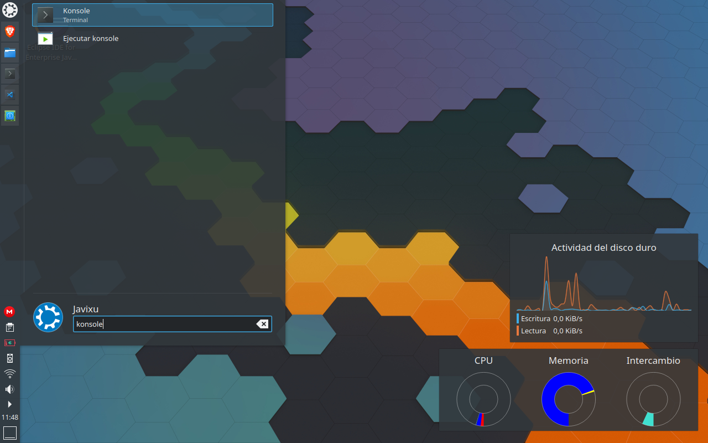

Desde hace un tiempo que estoy tratando de rehabilitar un viejo portátil para trabajar en cualquier parte si se da el caso, este cuenta con las siguientes características:
```
Sistema operativo: Kubuntu 20.10
Versión de KDE Plasma: 5.19.5
Versión de KDE Frameworks: 5.74.0
Versión de Qt: 5.14.2
Versión del kernel: 5.8.0-41-generic
Tipo de OS: 64 bits
Procesadores: 2 × Intel® Core™2 Duo CPU T5750 @ 2.00GHz
Memoria: 2,9 GiB de RAM
Procesador gráfico: Mesa DRI Intel® 965GM
```
Tocó reinstalarlo por nosecuantaava vez con el sistema operativo que elegí para él, Kubuntu, pero cuando le metía carga de trabajo, le daba un ictus y se apagaba. Puede ver que el problema estaba relacionado con la memoria, sus tres gigas son insuficientes para soportar toda la carga y la de intercambio que crea la instalación del sistema operativo es un chiste de un giga.
<!--more-->
Al final, después de mucho trastear por la red y de pura casualidad dí con una solución que había caído en el oscuro pozo del olvido, en lugar de crear una partición solo debía crear un archivo para el intercambio de memoria y que sobre un SSD solo supondrían unas décimas mas lento pero tendría el aumento de espacio de memoria que necesitaría para poder reutilizar el equipo. 

## Ampliando la memoria

Bien! Necesitaremos hacer todas las operaciones a través de un terminar por lo que pulsaremos la combinación de teclas ***Ctrl + Alt + T***, o bien, si pulsáis el botón del lanzador y escribís ***Terminal*** o ***Konsole*** aparecerá en la parte superior del panel del lanzador. Como puedes ver en la siguiente imagen. 

[](../assets/img/blog/Lanzador.png)

Una vez que ya lo tengamos abierto necesitaremos tener privilegios de superusuario, esto lo conseguiremos escribiendo ***sudo su*** en el terminal y acto seguido nos pedirá la contraseña del usuario ***root***.
```
$ sudo su 
```
## Creación del archivo
Ahora vamos a crear el archivo que dedicaremos como memoria de intercambio. Usaremos el parámetro ***count*** para asignarle el tamaño al archivo, el parámetro ***bs*** es el tamaño del bloque que dejaremos en un mega y ***of*** es la ubicación donde crearemos el archivo.
```
$ dd if=/dev/zero of=/mnt/fichero_swap1 bs=1M count=1024
```
Personalmente he creado un archivo llamado ***file_swap16***, el dieciséis del final es por la cantidad de memoria que le he asignado al archivo que es de 16384 megas (1024 * 16 = 16384), el resto lo dejé igual.

```
$ dd if=/dev/zero of=/mnt/file_swap16 bs=1M count=16384
```

Una vez terminado el proceso nos mostrará por consola una salida similar a esta.

```
16384+0 registros leídos
16384+0 registros escritos
17179869184 bytes (17 GB, 16 GiB) copied, 181,83 s, 94,5 MB/s
```

## Warning! permisos 0644 no seguros; se sugiere 0600
Este mensaje sale cuando se va a formatear el archivo que acabamos de crear. El sistema recomienda que se restrinjan los privilegios cambiando los permisos del archivo de ***0644*** a ***0600***, ¿como se hace esto? Pues poniendo lo siguiente en la línea de comandos.

```
$ chmod 600 /mnt/file_swap16
```
Pasará de tener los siguientes privilegios
```
-rw-r--r-- 1 root root 17179869184 feb  8 20:03 file_swap16
```
a estos otros mas adecuados
```
-rw------- 1 root root 17179869184 feb  8 20:03 file_swap16
```
A partir de aquí no mostrará el aviso de seguridad.

## Formateando y uso del archivo swap
Pues sí, hay que formatear el archivo para que el sistema operativo lo reconozca pero no es nada del otro mundo solo hay que poner ***mkswap*** y el nombre del archivo junto a su ubicación como estás viendo en el ejemplo.
```
$ mkswap /mnt/file_swap16
```
Una vez terminado debería aparecer un mensaje como este:
```
Configurando espacio de intercambio versión 1, tamaño = 16 GiB (17179865088 bytes)
sin etiqueta, UUID=d95bbcab-2d60-491e-8365-8b8b1bf85e7a
```
Ahora estamos listos para usar nuestro nuevo archivo de intercambio y para eso usaremos el comando ***swapon*** al que le indicaremos nombre y ruta del archivo.
```
$ swapon /mnt/file_swap16
```
## Un poco de información
Una vez llegado a este punto te preguntaras como puedes ver que todo está bien o si funciona lo que has hecho. El comando ***cat*** se encargará de mostrarnos la información del archivo meninfo, ahí veremos que todo está correcto.
```
$ cat /proc/meminfo
```
Como respuesta te debería mostrar algo similar al ejemplo que te dejo 
```

MemTotal:        3050772 kB
MemFree:          176680 kB
MemAvailable:    2270912 kB
Buffers:          173744 kB
Cached:          2075732 kB
SwapCached:          284 kB
Active:           698176 kB
Inactive:        1866144 kB
Active(anon):     140912 kB
Inactive(anon):   263672 kB
Active(file):     557264 kB
Inactive(file):  1602472 kB
Unevictable:       76848 kB
Mlocked:              68 kB
SwapTotal:      17780728 kB
SwapFree:       17779960 kB
Dirty:                 4 kB
Writeback:             0 kB
AnonPages:        391412 kB
Mapped:           214516 kB
Shmem:             89748 kB
KReclaimable:     126172 kB
Slab:             183580 kB
SReclaimable:     126172 kB
SUnreclaim:        57408 kB
KernelStack:        4480 kB
PageTables:         8800 kB
NFS_Unstable:          0 kB
Bounce:                0 kB
WritebackTmp:          0 kB
CommitLimit:    19306112 kB
Committed_AS:    1946780 kB
VmallocTotal:   34359738367 kB
VmallocUsed:       18828 kB
VmallocChunk:          0 kB
Percpu:             1264 kB
HardwareCorrupted:     0 kB
AnonHugePages:         0 kB
ShmemHugePages:        0 kB
ShmemPmdMapped:        0 kB
FileHugePages:         0 kB
FilePmdMapped:         0 kB
HugePages_Total:       0
HugePages_Free:        0
HugePages_Rsvd:        0
HugePages_Surp:        0
Hugepagesize:       2048 kB
Hugetlb:               0 kB
DirectMap4k:      131480 kB
DirectMap2M:     3004416 kB
```
Aunque a mi me gusta utilizar el comando ***grep*** para filtrar la información que vuelca en consola.
```
cat /proc/meminfo | grep Swap
```
```
SwapCached:       118760 kB
SwapTotal:      17780728 kB
SwapFree:       16383224 kB
```

## Haciendo permanentes los cambios

Si queremos conservar los cambios que hemos realizado y no se pierdan al apagar o reiniciar el equipo, deberemos modificar el archivo ***fstag*** que está alojado en el directorio ***etc*** para eso utilizaremos un editor cualquiera (vi, nano,...) y añadiremos al final la siguiente línea.
> ***Nota***: Recuerda que ***file_swap16*** es el nombre que yo le he dado al archivo y que tu puedes darle otro.
```
/mnt/fichero_swap1 none swap sw 0 0
```

Al abrir el archivo ***fstab*** con un editor veremos un contenido similar al ejemplo que te pongo mas abajo.
```
$ nano /etc/fstab
```

```
# /etc/fstab: static file system information.
#
# Use 'blkid' to print the universally unique identifier for a
# device; this may be used with UUID= as a more robust way to name devices
# that works even if disks are added and removed. See fstab(5).
#
# <file system> <mount point>   <type>  <options>       <dump>  <pass>
/dev/mapper/vgkubuntu-root /               ext4    errors=remount-ro 0   >
# /boot was on /dev/sda3 during installation
UUID=819ee695-43b4-4836-baa6-d627475130dc /boot           ext4    default>
# /boot/efi was on /dev/sda2 during installation
UUID=CF59-19C5  /boot/efi       vfat    umask=0077      0       1
/dev/mapper/vgkubuntu-swap_1 none            swap    sw              0   >
/mnt/file_swap16 none swap sw 0 0
```
Una vez guardados los cambios solo queda reiniciar y comprobar que los cambios que realizamos son persistentes con el comando ***cat*** junto con ***grep***.
```
cat /proc/meminfo | grep Swap
```